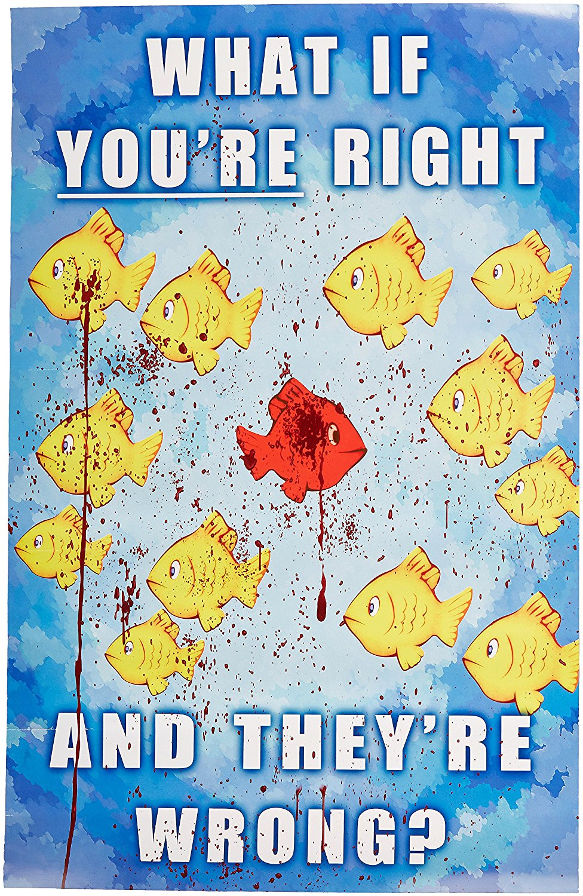

<p style='text-align: justify;'>

Aprender un lenguaje de programación es interesante y entretenido a la vez, más si te gusta trabajar con datos. Se tiende a caer en la (erronea) idea que la programación es sólo para aquellas personas con un *background* en informática o programación, no obstante, programar es una habilidad multidiciplinaria cuyo límites son tus ideas. 

</p>

> "Cualquier tecnología suficientemente avanzada es indistinguible de la magia." 
   - Arthur C. Clarke 


```{r,echo=FALSE}
library(knitr)
opts_knit$set(animation.fun = hook_scianimator)
knitr::opts_chunk$set(echo = TRUE, fig.align="center")
```


<p align="center">
{width=50%}
</p>

$$Y = \alpha \cdot \sin(X), \alpha = 0,0.1,0.2,...,3$$


```{r, echo = FALSE, fig.align='center'}
library(tidyverse)
cool_function <- function(x, alpha) return(sin(alpha*x))
xs <- seq(0, pi*1.5, 0.005)
ys <- cool_function(xs, 1)
results <- data_frame(xs, ys, alpha = "1")
for(alpha in seq(0,3, 0.1)){
  results <- results %>% 
    bind_rows(data_frame(
      xs, 
      ys = cool_function(xs, alpha),
      alpha = as.character(alpha)
    ))
}

ggplot(results, aes(x = xs, y = ys, color = alpha)) + 
  geom_line() + 
  theme_bw() + 
  theme(legend.position="none")
```

```{r Code Chunk, echo = FALSE, fig.align='center'}
library(plotly)
library(quantmod)

getSymbols("AAPL",src='yahoo')

df <- data.frame(Date=index(AAPL),coredata(AAPL))
df <- tail(df, 30)
df$ID <- seq.int(nrow(df))

accumulate_by <- function(dat, var) {
  var <- lazyeval::f_eval(var, dat)
  lvls <- plotly:::getLevels(var)
  dats <- lapply(seq_along(lvls), function(x) {
    cbind(dat[var %in% lvls[seq(1, x)], ], frame = lvls[[x]])
  })
  dplyr::bind_rows(dats)
}

df <- df %>%
  accumulate_by(~ID)

p <- df %>%
  plot_ly(
    x = ~ID, 
    y = ~AAPL.Close, 
    frame = ~frame,
    type = 'scatter', 
    mode = 'lines', 
    fill = 'tozeroy', 
    fillcolor='rgba(114, 186, 59, 0.5)',
    line = list(color = 'rgb(114, 186, 59)'),
    text = ~paste("Day: ", ID, "<br>Close: $", AAPL.Close), 
    hoverinfo = 'text'
  ) %>%
  layout(
    title = "AAPL: Last 30 days",
    yaxis = list(
      title = "Close", 
      range = c(0,200), 
      zeroline = F,
      tickprefix = "$"
    ),
    xaxis = list(
      title = "Day", 
      range = c(0,30), 
      zeroline = F, 
      showgrid = F
    )
  ) %>% 
  animation_opts(
    frame = 100, 
    transition = 0, 
    redraw = FALSE
  ) %>%
  animation_slider(
    currentvalue = list(
      prefix = "Day "
    )
  )

```